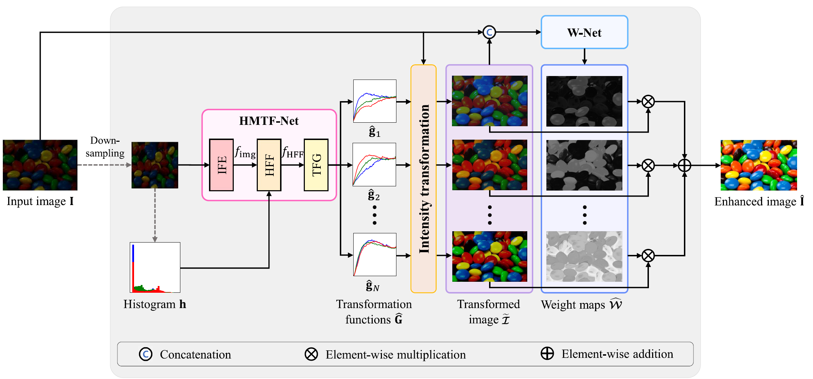

# MTFE

### Jaemin Park, An Gia Vien, Minhee Cha, Hanul Kim, and Chul Lee
Official pytorch implementation for **"Multiple Transformation Function Estimation for Image Enhancement"**

<p float="left">
  &emsp;&emsp; 
</p>

## Preparation
### Training data: [Download from GoogleDrive](https://drive.google.com/file/d/1jekxUtXmcU79DfnyTMbLEUm9y6vQwuVU/view?usp=sharing)
The ZIP file contains three test datasets:
- LOL dataset: 485 image pairs
- FiveK dataset: 4,500 image pairs
- EUVP dataset: 11,435 image pairs

### Testing samples: [Download from GoogleDrive](https://drive.google.com/file/d/1bnmfDTkcK-Sq2KGIWnv9QmEZUWyHg4x5/view?usp=sharing)
The ZIP file contains three test datasets:
- LOL dataset: 15 image pairs
- FiveK dataset: 500 image pairs
- EUVP dataset: 515 image pairs

### Pretrained weights: [Download from GoogleDrive](https://drive.google.com/file/d/1SM54xIQ5q-vtdPdg-0LVlGjsM98YqWhR/view?usp=sharing)
The ZIP file contains weight files trained with each training dataset.

## Training
1. Put low-quality images of training dataset in ./data/train_data/input
2. Put high-quality images of training dataset in ./data/train_data/gt
3. Put test images in ./data/test_data/LOL
4. Put ground-truths of test images in ./data/test_gt
5. Run below commend:
```
python lowlight_train.py
```
6. The trained model is saved at ./models
7. The result images are saved at ./data/analysis

## Testing
1. Put test images in ./data/test_data/LOL
2. Put ground-truths of test images in ./data/test_gt
3. Run below commend:
```
python lowlight_test.py
```
4. The result images are saved at ./data/analysis

## Citation
If you find this work useful for your research, please consider citing our paper:
```
@article{Park2023,
    author={Park, Jaemin and Vien, An Gia and Cha, Minhee and Pham, Thuy Thi and Kim, Hanul and Lee, Chul},
    booktitle={Journal of Visual Communication and Image Representation},
    title={Multiple Transformation Function Estimation for Image Enhancement}, 
    year={2023},
    volume={62},
    pages={103863},
    publisher={Elsevier}
    }
}
```

## License
See [MIT License](https://github.com/PJaemin/MTFE/blob/main/LICENSE)


